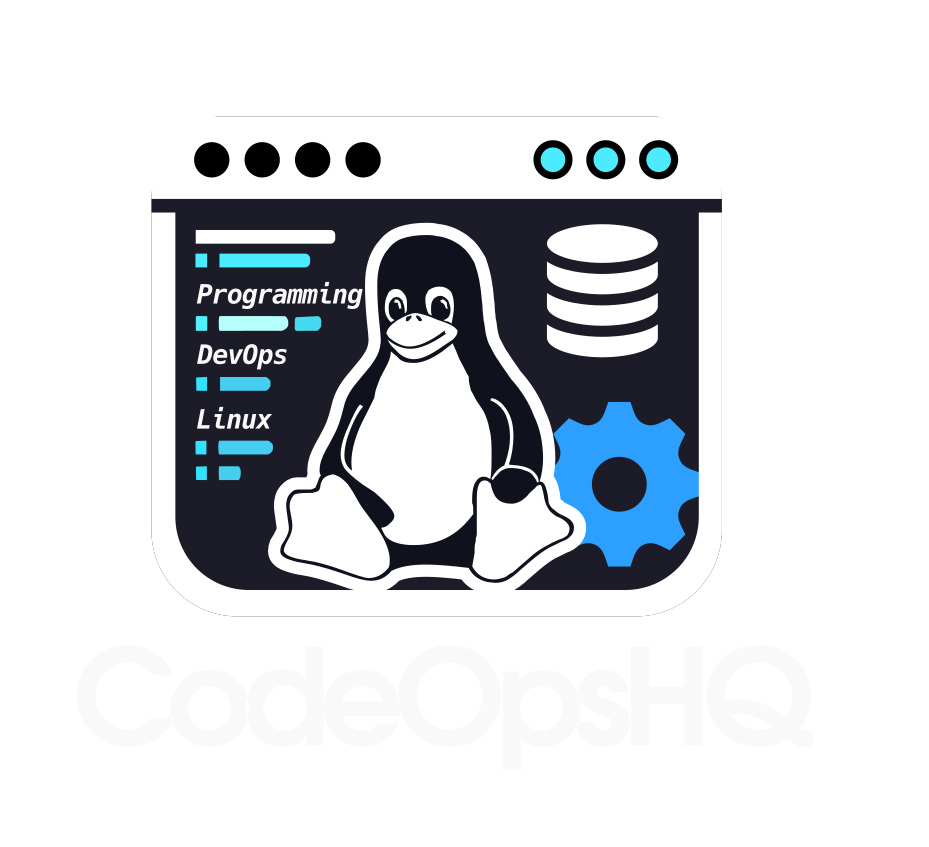

# CodeOps HQ YouTube Channel Website



## Table of Contents

- [Introduction](#introduction)
- [Features](#features)
- [Installation](#installation)
- [Usage](#usage)
- [Project Structure](#project-structure)
- [Contributing](#contributing)
- [License](#license)
- [Contact](#contact)
- [Support](#support)

## Introduction

Welcome to the **CodeOps HQ YouTube Channel Website**, a modern web application built with [Yew](https://yew.rs/) and [Trunk](https://github.com/thedodd/trunk) for seamless Rust-based frontend development. This website serves as a centralized hub for showcasing your YouTube tutorials, channel videos, and providing visitors with an engaging platform to explore your content.


## Features

- **Responsive Design**: Optimized for various devices to ensure a seamless viewing experience.
- **YouTube Integration**: Displays your latest channel videos directly on the website.
- **Dark Mode Support**: Toggle between light and dark themes for comfortable browsing.
- **Interactive Components**: Includes dynamic sections like tutorials and about pages.
- **Optimized Performance**: Built with Rust and WASM for fast and efficient performance.

## Installation

### Prerequisites

- **Rust**: Ensure you have Rust installed. If not, install it from [here](https://www.rust-lang.org/tools/install).
- **Trunk**: Install Trunk and WASM Bindgen CLI using Cargo:

  ```bash
  cargo install trunk wasm-bindgen-cli
  ```

### Setting Up the Project

1. **Clone the Repository**

   ```bash
   git clone https://github.com/codeopshq/website.git
   cd website
   ```

2. **Add WASM Target**

   ```bash
   rustup target add wasm32-unknown-unknown
   ```

3. **Install Dependencies**

   Ensure all dependencies are specified in `Cargo.toml`.

## Usage

### Running the Development Server

Start the development server with live-reloading:

```bash
trunk serve
```

This command rebuilds the app whenever changes are detected and hosts it locally.

### Building for Release

Generate an optimized build for production:

```bash
trunk build --release
```

The output will be located in the `dist` directory by default. You can also pass the `--release` flag to `trunk serve` for performance-focused development.

## Project Structure

```
├── README.md
├── Cargo.toml
├── index.html
├── index.scss
├── LICENSE-MIT
├── src
│   ├── api
│   │   └── youtube
│   │       └── channel_videos.rs
│   ├── components
│   │   └── footer
│   │       └── footer.rs
│   └── pages
│       ├── about.rs
│       └── tutorials.rs
│ 
│ 
├── assests
│   ├── css
│   ├── icons
│   ├── img
│   └── svg
│
```

### Highlights from the Codebase

- **`src/api/youtube/channel_videos.rs`**: Handles fetching and displaying videos from your YouTube channel.

  ```rust
  // src/api/youtube/channel_videos.rs
  use crate::api::youtube::youtube_api::{
      get_channel_uploads_playlist, get_playlist_videos, PlaylistItem,
  };
  use wasm_bindgen_futures::spawn_local;
  use yew::prelude::*;

  use crate::components::{
      load_more_section::LoadMoreSection, skeleton_grid::SkeletonGrid, video_grid::VideoGrid,
  };

  #[function_component(ChannelVideos)]
  ```

- **`src/pages/tutorials.rs`**: Renders the tutorials section showcasing your YouTube tutorials.

  ```rust
  // src/pages/tutorials.rs
  use yew::prelude::*;

  use crate::api::youtube::channel_videos::ChannelVideos;

  #[function_component(Tutorials)]
  pub fn tutorials() -> Html {
      html! {
      <>
          <div class="flex py-16 items-center justify-center">
              <h2 class="text-5xl font-extrabold text-transparent bg-clip-text bg-gradient-to-r from-red-400 to-blue-500">
                  {"Tutorials Videos"}
              </h2>
          </div>
          <ChannelVideos />
      </>
      }
  }
  ```

- **`src/pages/about.rs`**: Provides information about the YouTube channel and subscription links.

  ```rust
  // src/pages/about.rs
  pub fn about() -> Html {
      // Placeholder for the YouTube Channel ID - replace with the actual ID
      const YOUTUBE_CHANNEL_ID: &str = "@CodeOpsHQ";
      let youtube_subscribe_link = format!(
          "https://www.youtube.com/{}?sub_confirmation=1",
          YOUTUBE_CHANNEL_ID
      );

      html! {
      // Add a container with padding for overall spacing
  }
  ```

## Contributing

If you encounter any issues or have suggestions for improvements, please open an issue on our [GitHub repository](https://github.com/codeopshq/website/issues) or submit a pull request.

## License

This project is licensed under the [MIT](LICENSE-MIT) licenses.

## Contact

For any inquiries or support, please contact us via email or open an issue on our [GitHub repository](https://github.com/codeopshq/website/issues).

## Support

If you like this project, please consider supporting us:

- [GitHub Sponsors](https://github.com/sponsors/codeopshq)
- [Buy us a coffee](https://www.buymeacoffee.com/codeopshq)

---

Thank you for visiting the CodeOps HQ YouTube Channel Website! We hope this platform enhances your learning experience and provides valuable resources for your development journey.

---
